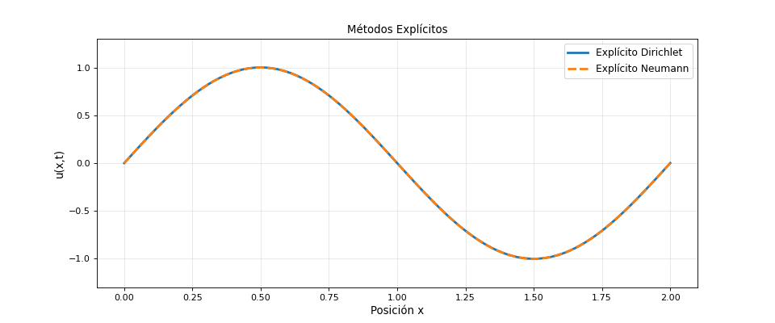
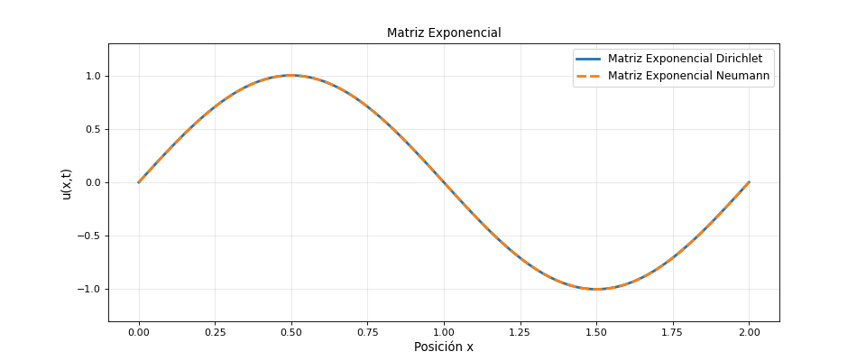
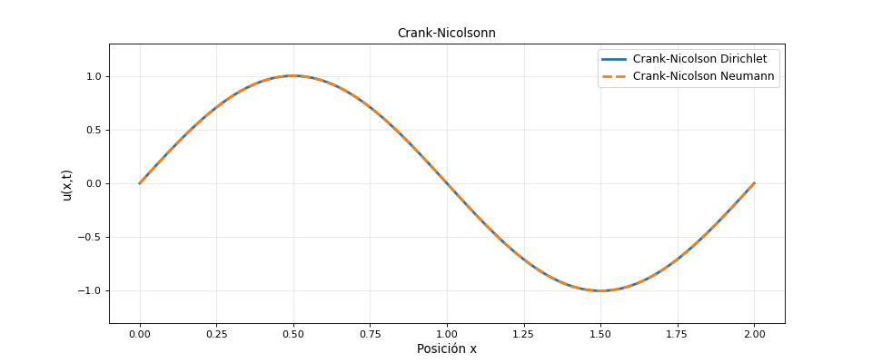
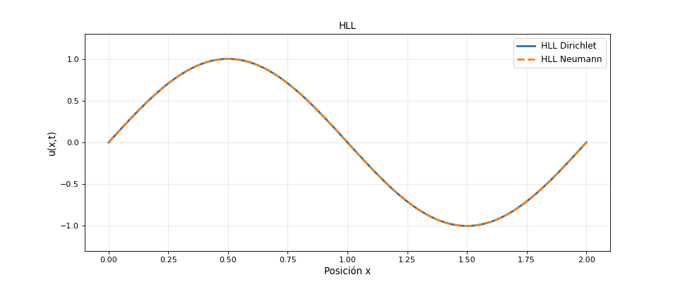
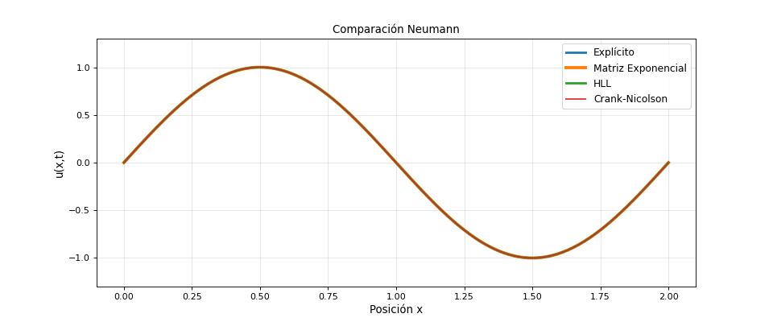

# Results Summary and Physical Interpretation

This document interprets the six GIF outputs included in the repository. The goal is not only to describe what is visible in each animation, but to explain what each result shows about the numerical method, the physical damping, the boundary conditions and the artificial dissipation introduced by different algorithms.

The six animations are:

1. explicit finite-difference method,
2. matrix exponential method,
3. Crank--Nicolson method,
4. HLL/HLLE flux method,
5. method comparison under Dirichlet boundary conditions,
6. method comparison under Neumann boundary conditions.

---

## 1. Purpose of the comparison

All animations correspond to the same general physical model: the damped one-dimensional wave / telegraph equation,

$$
\frac{\partial^2 u}{\partial t^2}
-
c^2
\frac{\partial^2 u}{\partial x^2}
=
-2\frac{\kappa}{\rho}
\frac{\partial u}{\partial t}
+
a u.
$$

The point of showing several methods is that the same physical equation can look slightly different depending on how it is discretized and evolved. These differences are not random. They reflect the numerical character of each method.

The explicit method is local and direct. The matrix exponential method evolves the spatially discretized linear system almost exactly in time. Crank--Nicolson uses an implicit second-order approximation to the same evolution. HLL/HLLE treats the system as a conservative hyperbolic problem and computes numerical fluxes between cells.

Therefore, the animations should be read as a method comparison. The question is not only whether the wave moves and decays, but how much of the observed decay is physical and how much is introduced by the algorithm.

---

## 2. Explicit finite-difference method

The explicit finite-difference method is the most direct numerical scheme in the repository. It comes from replacing the derivatives in the PDE by finite differences and solving algebraically for the next time level.

Its main advantage is transparency. The update formula is local: each value of $u_j^{n+1}$ depends on neighbouring grid points and previous time levels. This makes the method easy to understand and computationally cheap per step.

The animation should show the wave evolving in time while its amplitude decreases. Part of this decay is physical because the equation contains the damping term

$$
-2\frac{\kappa}{\rho}
\frac{\partial u}{\partial t}.
$$

However, the explicit method can also introduce artificial damping. If the wave loses amplitude faster than in the matrix exponential or Crank--Nicolson results, that additional decay should be interpreted as numerical dissipation.

The explicit method is also constrained by the CFL condition,

$$
\frac{c\Delta t}{\Delta x}\leq 1.
$$

This condition is required for stability, but it does not guarantee high accuracy. A stable explicit solution can still have phase error or excessive amplitude decay. This is why the explicit method is best understood as a simple baseline rather than as the most accurate reference.

---

## 3. Matrix exponential method

The matrix exponential method first rewrites the PDE as a first-order system,

$$
\frac{d\mathbf{W}}{dt}
=
\mathbf{A}\mathbf{W}.
$$

After spatial discretization, the exact time evolution of this system is

$$
\mathbf{W}^{n+1}
=
e^{\mathbf{A}\Delta t}
\mathbf{W}^{n}.
$$

This makes the matrix exponential method the cleanest reference among the four methods. It does not remove spatial discretization error, but it treats the time evolution of the semi-discrete linear system with very high fidelity.

In the animation, the damping should primarily reflect the physical damping present in the equation. Compared with the explicit method, the matrix exponential result should show cleaner phase evolution and less artificial dissipation.

This method is therefore useful as a benchmark. If another method produces a visibly stronger decay or a noticeably shifted wave, the matrix exponential result helps identify the discrepancy as a numerical effect.

Its limitation is computational cost. Computing a matrix exponential can be expensive. For this practice, however, it is extremely valuable because it gives a high-quality reference for comparison.

---

## 4. Crank--Nicolson method

The Crank--Nicolson method also uses the first-order matrix formulation, but instead of computing the exact matrix exponential, it uses the semi-implicit update

$$
\left(
\mathbf{I}
-
\frac{\Delta t}{2}\mathbf{A}
\right)
\mathbf{W}^{n+1}
=
\left(
\mathbf{I}
+
\frac{\Delta t}{2}\mathbf{A}
\right)
\mathbf{W}^{n}.
$$

This can be interpreted as a rational approximation to the matrix exponential. It is second order in time and generally much more stable than a simple explicit method.

The animation should be compared especially with the matrix exponential animation. If the two are visually close, that means Crank--Nicolson is accurately reproducing the damped wave dynamics. This agreement is expected because Crank--Nicolson is well suited for linear evolution problems.

Crank--Nicolson is often the best practical compromise in the repository. It is more accurate and stable than the explicit method, but more practical than computing a full matrix exponential for large systems. Its main computational cost is solving a linear system at each time step.

The result demonstrates why implicit or semi-implicit schemes are widely used in computational physics: they can preserve the qualitative structure of the solution much better than a purely explicit method.

---

## 5. HLL/HLLE flux method

The HLL/HLLE method represents a different numerical philosophy. It does not simply discretize the second-order equation directly. Instead, the problem is written in a conservative hyperbolic form,

$$
\frac{\partial \mathbf{U}}{\partial t}
+
\frac{\partial \mathbf{F}(\mathbf{U})}{\partial x}
=
\mathbf{S}(\mathbf{U}).
$$

The method then computes fluxes at cell interfaces using approximate characteristic wave speeds. For this wave system, the relevant propagation speeds are related to $-c$ and $+c$.

The HLL flux has the form

$$
\mathbf{F}_{HLL}
=
\frac{
S_R\mathbf{F}_L
-
S_L\mathbf{F}_R
+
S_LS_R
(\mathbf{U}_R-\mathbf{U}_L)
}{
S_R-S_L
}.
$$

The key feature is the stabilizing term involving the jump $\mathbf{U}_R-\mathbf{U}_L$. This term introduces numerical viscosity.

In the animation, the HLL solution may look smoother or more strongly damped than the matrix exponential and Crank--Nicolson results. This is not necessarily an error. It is a consequence of the method’s design. HLL/HLLE is robust for hyperbolic systems and suppresses spurious oscillations, but that robustness comes with extra diffusion.

For smooth linear waves, this can make HLL look less sharp. For more difficult hyperbolic problems, especially those with discontinuities, this same property becomes a strength.

---

## 6. Dirichlet boundary-condition comparison

The Dirichlet comparison places the methods under fixed-end boundary conditions,

$$
u(0,t)=0,
\qquad
u(L,t)=0.
$$

These conditions force the field to vanish at the endpoints. Physically, this resembles a string fixed at both ends. The endpoints cannot move, and the allowed modes must be compatible with this constraint.

This comparison is especially useful because the physical boundary condition is the same for all methods. Therefore, visible differences between the curves are mainly due to the numerical method rather than the physical setup.

The matrix exponential and Crank--Nicolson methods should agree closely because both are based on the first-order matrix formulation and both represent time evolution accurately. The explicit method may show more damping or phase difference. The HLL/HLLE method may appear smoother because of numerical viscosity.

This animation summarizes the central lesson of the project: even for the same equation, same parameters and same boundary conditions, different numerical methods can produce different levels of artificial damping.

---

## 7. Neumann boundary-condition comparison

The Neumann comparison uses derivative boundary conditions, typically of the form

$$
\frac{\partial u}{\partial x}=0
$$

at the boundary. This represents a zero-gradient or free-end constraint.

This is physically different from Dirichlet. A Dirichlet boundary fixes the value of the field. A Neumann boundary fixes the slope. As a result, the reflected wave and allowed modes are different.

The comparison is also numerically important. Neumann conditions are usually more delicate to implement than Dirichlet conditions because they require one-sided approximations, ghost-point relations or modified matrix rows.

If the methods remain consistent under Neumann conditions, this supports the correctness of the boundary implementation. Differences between methods should again be interpreted through the same numerical lens: explicit damping, matrix exponential reference behaviour, Crank--Nicolson accuracy and HLL numerical viscosity.

---

## 8. Physical damping versus numerical damping

The most important interpretative distinction in the results is between physical and numerical damping.

Physical damping comes from the equation:

$$
-2\frac{\kappa}{\rho}
\frac{\partial u}{\partial t}.
$$

It should appear in all methods.

Numerical damping comes from the algorithm. It may arise from:
- explicit discretization,
- coarse time steps,
- coarse spatial resolution,
- boundary approximations,
- HLL/HLLE numerical viscosity.

The matrix exponential result is expected to show damping that is closest to the physical damping of the semi-discrete system. Crank--Nicolson should be close to it. The explicit method may add more artificial decay. HLL/HLLE may add the most smoothing because its flux formula is designed for robustness.

Therefore, when comparing the six GIFs, the main question is not simply which method damps the wave. The real question is which part of the damping belongs to the physical equation and which part is produced by the numerical method.

---

## 9. Overall conclusions

The six animations provide a compact but meaningful comparison of four numerical approaches to the damped wave / telegraph equation.

The explicit finite-difference method is simple and transparent, but conditionally stable and potentially more dissipative.

The matrix exponential method is the most faithful reference for the spatially discretized linear system, but it can be computationally expensive.

Crank--Nicolson provides a strong practical compromise between accuracy, stability and computational cost.

HLL/HLLE is the most conservative and hyperbolic-flux-oriented method. It is robust and appropriate for finite-volume thinking, but introduces numerical viscosity that is visible in smooth wave problems.

The Dirichlet and Neumann comparisons show that boundary conditions are not secondary details. They change the physical problem and must be implemented consistently.

Overall, the project demonstrates the ability to connect PDE theory, numerical analysis, boundary-condition implementation, matrix methods, conservative fluxes and scientific visualization in a single computational-physics workflow.
